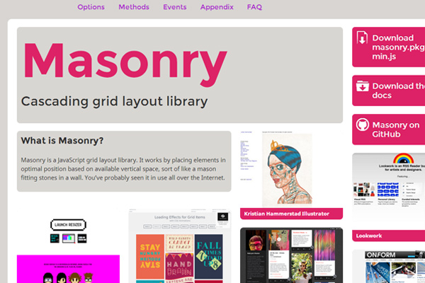

虽然我的注意力主要在机器学习和服务端的架构，但是前端领域也在生机勃勃地发展，有很多激动人心的创意、新技术、设计理念的更新和美学的极致体验。今天在网上找到一些有价值的文章，分享给大家。

*[Web Design: 20 Hottest Trends To Watch Out For In 2014](http://www.hongkiat.com/blog/web-design-trends-2014/)* 是一篇很棒的文章，总结了本年度（2014）年在Web Design方面可去观察的20个热点。作者自身的设计水平就很高，了解业界的动态和趋势，掌握资料翔实。如下概括这20个要点，详细的内容请参考[原文](http://www.hongkiat.com/blog/web-design-trends-2014/)。

### Grid-Style Layouts 网格式布局
对网格设计的主流认识来自[pinterest](https://www.pinterest.com)。这并非说要强制老的网站这么做，而是要看目的是什么。**用户体验**总是首先被考虑的。在使用微缩图或文字更新的场合下，网格布局能将所有内容压缩到一个易于阅读的格式，让用户可以快速略读。同时，页面内容可以保持一致并不占太多空间。

诸如开源js库[masonry](http://masonry.desandro.com)，可以帮你做大量繁重的工作。

没有太多的网站利用这一特性，但凡使用的，经常让视觉很舒服。

